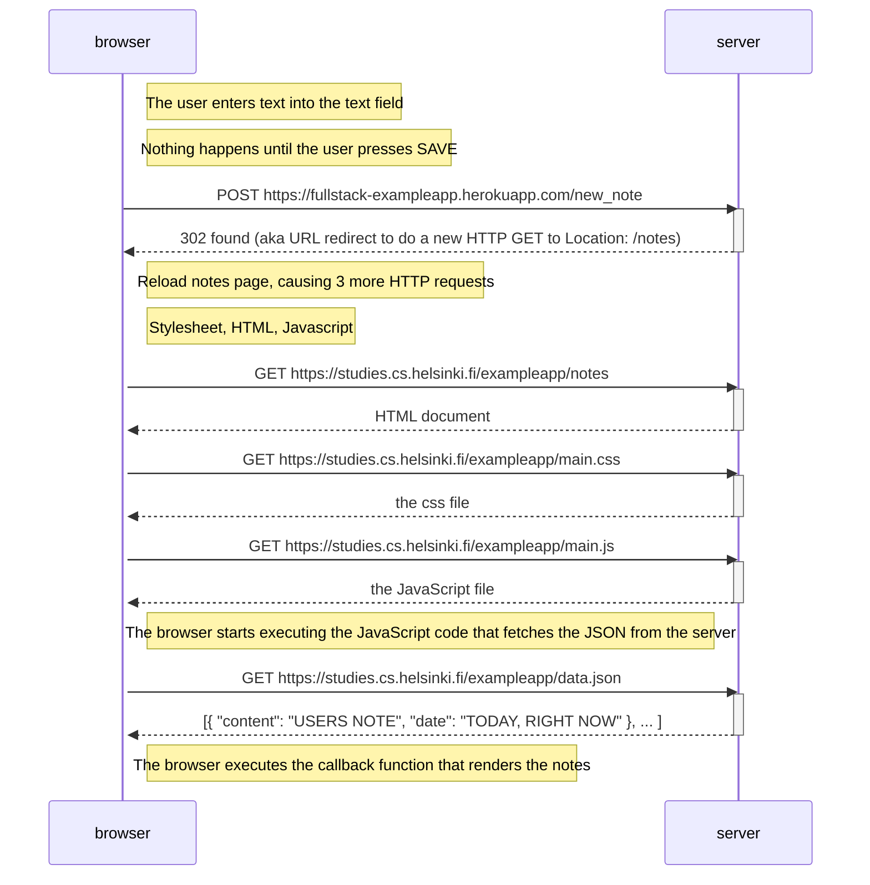

```mermaid
sequenceDiagram
    participant browser
    participant server

    

    Note right of browser: The user enters text into the text field
    Note right of browser: Nothing happens until the user presses SAVE
    browser->>server: POST https://fullstack-exampleapp.herokuapp.com/new_note
    activate server
    server-->>browser: 302 found (aka URL redirect to do a new HTTP GET to Location: /notes)
    deactivate server
    activate browser
    Note right of browser: Reload notes page, causing 3 more HTTP requests
    Note right of browser: Stylesheet, HTML, Javascript

    browser->>server: GET https://studies.cs.helsinki.fi/exampleapp/notes
    activate server
    server-->>browser: HTML document
    deactivate server

    browser->>server: GET https://studies.cs.helsinki.fi/exampleapp/main.css
    activate server
    server-->>browser: the css file
    deactivate server

    browser->>server: GET https://studies.cs.helsinki.fi/exampleapp/main.js
    activate server
    server-->>browser: the JavaScript file
    deactivate server

    Note right of browser: The browser starts executing the JavaScript code that fetches the JSON from the server

    browser->>server: GET https://studies.cs.helsinki.fi/exampleapp/data.json
    activate server
    server-->>browser: [{ "content": "USERS NOTE", "date": "TODAY, RIGHT NOW" }, ... ]
    deactivate server

    Note right of browser: The browser executes the callback function that renders the notes

```
