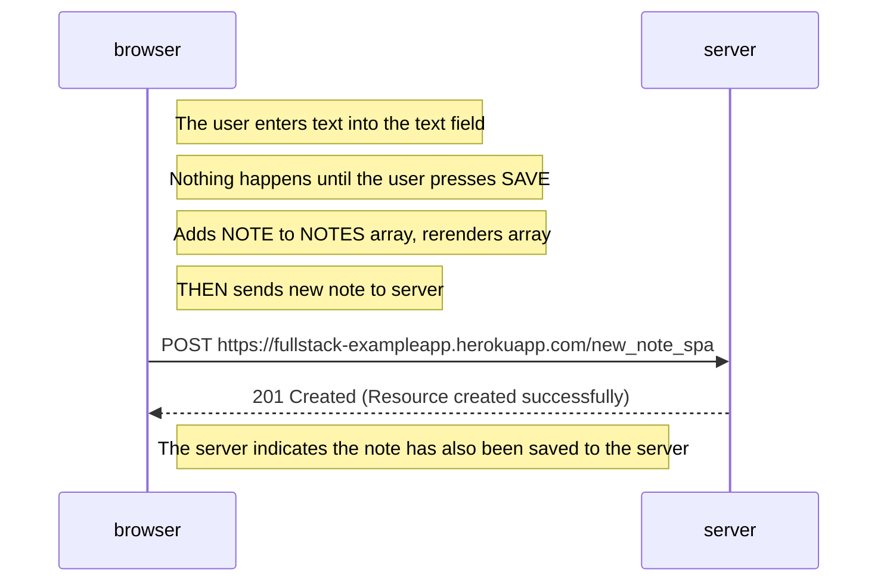

```mermaid
sequenceDiagram
    participant browser
    participant server

    Note right of browser: The user enters text into the text field
    Note right of browser: Nothing happens until the user presses SAVE
    Note right of browser: Adds NOTE to NOTES array, rerenders array
    Note right of browser: THEN sends new note to server
    browser->>server: POST https://fullstack-exampleapp.herokuapp.com/new_note_spa

    server-->>browser: 201 Created (Resource created successfully)


    Note right of browser: The server indicates the note has also been saved to the server
    

```
